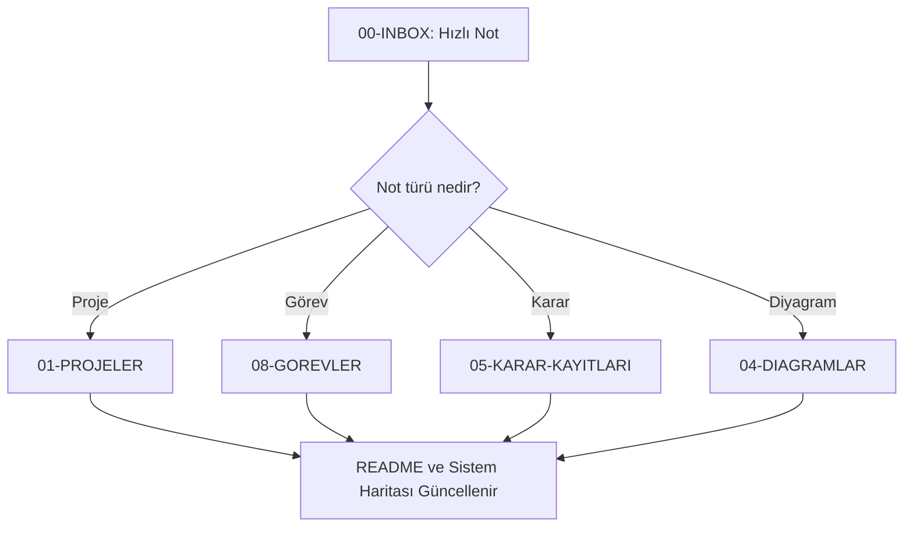
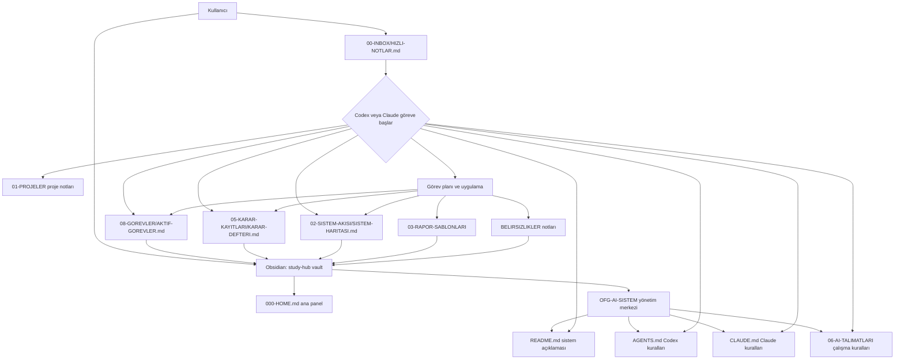
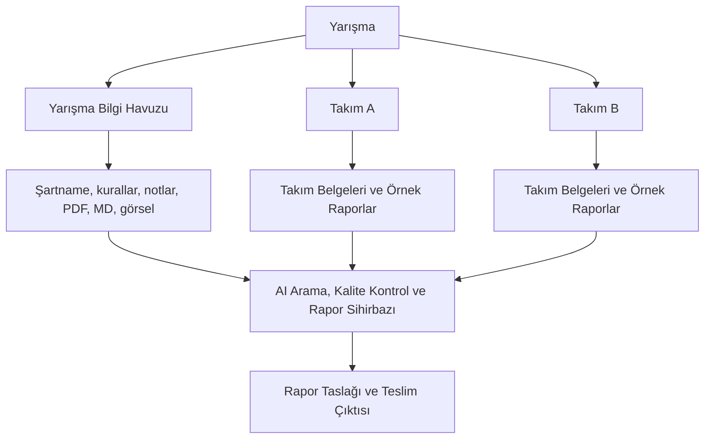
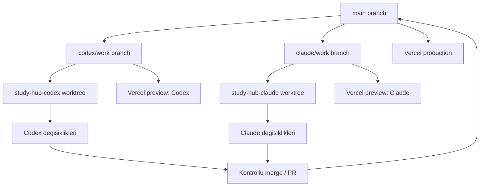

# Sistem Haritası

Bu dosya sistemin genel bileşenlerini, bilgi akışını ve AI araçlarının rolünü açıklar.

## Ana Bileşenler

- Obsidian: Markdown tabanlı görsel bilgi yönetimi.
- Codex: Dosya düzenleme, görev takibi ve teknik uygulama desteği.
- Claude: Analiz, raporlama, strateji ve karar destek.
- Markdown Vault: Ortak proje hafızası.

## Örnek Sistem Akışı

## Güncelleme Notları

Sistem yapısı, klasör sorumlulukları veya AI çalışma düzeni değiştiğinde bu dosya güncellenmelidir.

## OFG-AI Obsidian Çalışma Mantığı

## Klasör Sorumlulukları

- `00-INBOX`: Hızlı ve dağınık fikir girişi.
- `01-PROJELER`: Proje bazlı özet, görev, karar ve changelog notları.
- `02-SISTEM-AKISI`: Sistem haritası, bilgi akışı ve Mermaid diyagramları.
- `03-RAPOR-SABLONLARI`: Rapor şablonları ve başarılı rapor analizleri.
- `04-DIAGRAMLAR`: Ayrı diyagram notları ve şema denemeleri.
- `05-KARAR-KAYITLARI`: Tarihli karar defteri.
- `06-AI-TALIMATLARI`: Codex, Claude ve diğer AI ajanları için çalışma kuralları.
- `07-TOPLANTI-NOTLARI`: Toplantı notları.
- `08-GOREVLER`: Aktif ve tamamlanmış görev listeleri.
- `09-ARSIV`: Eski veya tamamlanmış işler.

## Yarışma Odaklı Rapor Sistemi

- Yarışma bilgi havuzu ortak bağlamdır; aynı yarışmadaki tüm takımlar bu bilgiden yararlanır.
- Takım belgeleri, örnek raporlar, jüri geri bildirimi ve rapor taslakları takım bazlı izole kalır.
- Eski takımlar geriye uyumluluk için `Genel Yarışma Havuzu` altında gösterilir.

## Git Worktree Ajan Izolasyonu

- `main` entegrasyon ve production branch'idir.
- Codex yalnizca `study-hub-codex` worktree icinde `codex/work` branch'iyle calisir.
- Claude yalnizca `study-hub-claude` worktree icinde `claude/work` branch'iyle calisir.
- Preview deploy'lar branch bazlidir; production merge kullanici onayi ister.
