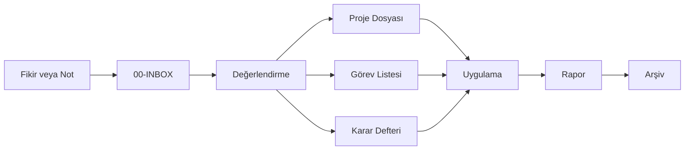

# Genel Akış Diyagramı

Bu dosya vault içindeki bilgi ve görev akışını Mermaid formatında örnekler.

## Diyagram Notları

- Yeni süreçler için ayrı Mermaid blokları eklenebilir.
- Büyük sistemler için diyagramlar alt başlıklara ayrılmalıdır.
- Diyagram değiştiğinde ilgili sistem veya proje dosyasına bağlantı verilmelidir.
